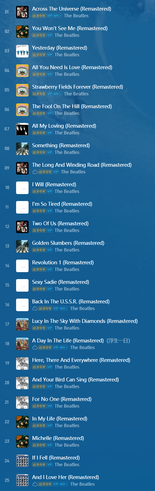

&nbsp;&nbsp;&nbsp;&nbsp;&nbsp;&nbsp;&nbsp;&nbsp;想用 aplayer 在文章中插入本地音乐，折腾了好久依然没有效果，遂放弃，等以后有时间的时候再折腾吧。
&nbsp;&nbsp;&nbsp;&nbsp;&nbsp;&nbsp;&nbsp;&nbsp;曾经在网易云建过一个歌单，叫做「二十五只甲壳虫」，当时给歌单写的描述是「个人心中披头士TOP25，排名不分先后，但第一永远会是 **Across the Universe**」今天重新打开这个歌单，发现有不少我很喜欢的歌没在里面（比如 *Till There Was You*），突然觉得二十五首还是太少了，不够放。

统计一下现在歌单里的曲目：

- *Please Please Me*：0首
- *With The Beatles*：1首
- *A Hard Day's Night*：2首
- *Beatles For Sale*：0首
- *Help*：1首
- *Rubber Soul*：3首
- *Revolver*：3首
- *Sgt. Pepper's Lonely Hearts Club Band*：2首
- *Magical Mystery Tour*：3首
- *The Beatles*：5首
- *Abbey Road*：2首
- *Let It Be*：3首
合计：25首
