以下仅为个人经验分享，可能具有**时效性**和**特殊性**，旨在提高读者申请时的通过率，不保证一定能通过。如果文章有问题欢迎评论留言或者给我发邮件：elizabeththhh@gmail.com

## 一、 GitHub 账号准备

&nbsp;&nbsp;&nbsp;&nbsp;访问 GitHub 需要科学上网，具体方法请自行搜索

1. 如果你没有 GitHub 账号，请前往[ GitHub ](https://gitHub.com/signup)注册一个账号。注册时使用教育邮箱（`edu.cn`后缀）

2. 如果你已经有了 GitHub 账号，请确保你添加了并验证了教育邮箱[ GitHub邮箱设置 ](https://gitHub.com/settings/emails)

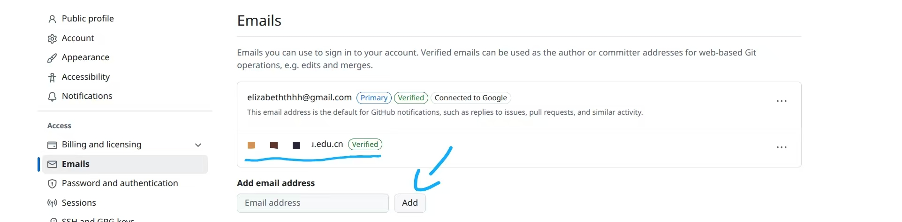

最后教育邮箱旁要出现`Verified`标签

3. **账号信息设置**（最关键的一步！）
&nbsp;&nbsp;&nbsp;&nbsp;&nbsp;&nbsp;&nbsp;&nbsp;笔者因为账号设置的问题申请失败了二十次（特别鸣谢 GitHub 的优秀审核系统），折腾了好几个小时，包括但不限于拿着录取通知书对着电脑屏幕手舞足蹈，将自己的中文/英文姓名各种排列组合填进账号信息......终于在即将崩溃的时候灵机一动成功了。

    &nbsp;&nbsp;&nbsp;&nbsp;&nbsp;&nbsp;&nbsp;&nbsp;好的闲话少叙（咳咳）
    - 第一步，将自己的名字扔进[微软翻译](https://www.bing.com/translator?setlang=zh-cn)（我猜是因为 GitHub 是微软家的，识别证明文件用的也是自家翻译。笔者最后福至心灵把名字换成了这个翻译才通过了）

    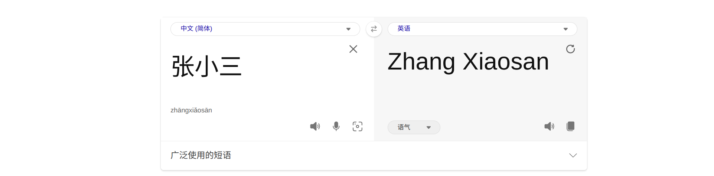

    - 第二步，将翻译的结果复制到[ GitHub 个人档案](https://gitHub.com/settings/profile)的 Name 栏下，然后在 Bio 一栏填入“xx University major in ......”， URL 填入学校的官方网址， Company 填入学校的官方英文名称， Location 填写学校地址即可
    
    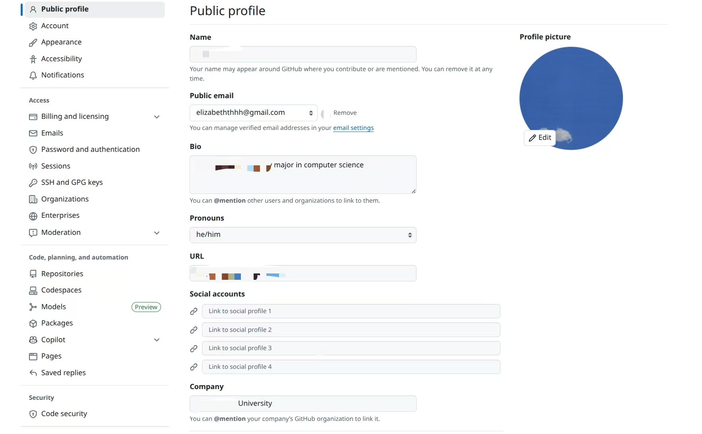

    - 第三步，在[ Payment infomation ](https://gitHub.com/settings/billing/payment_information)页面填写资料
    **注意**：将刚才翻译好的名字，空格前的内容填入**First Name**，空格后的内容填进**Last Name**（不要管姓氏名字的语义问题，填就对了）。例如张小三翻译成**Zhang** **Xiaosan**，按图中的填就好。剩余内容如实填写即可。

    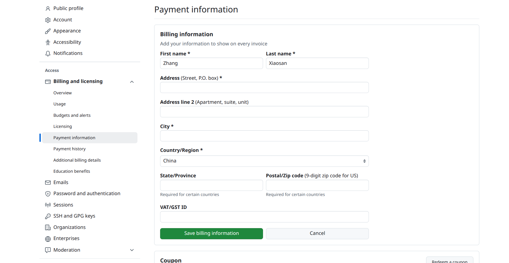

&nbsp;&nbsp;&nbsp;&nbsp;最后，申请成功之后，上述信息都可以自行更改。不用担心实名上网。

4. 开启2FA认证
    1. 前往[密码和验证](https://github.com/settings/security)开启 2FA 认证

    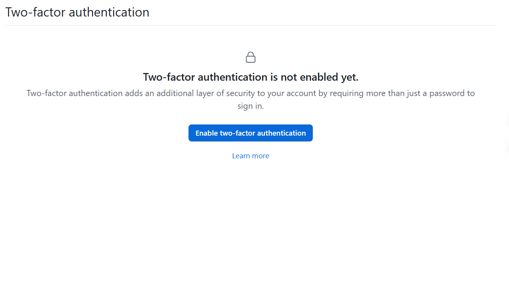

    2. 点击 **Enable two-factor authentication** 进入以下界面

    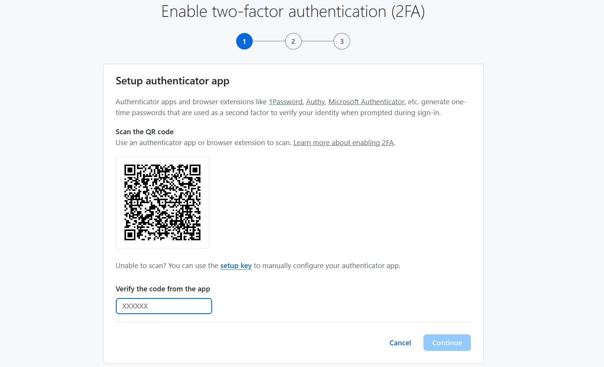

    3. 微信小程序搜索 **数盾OTP**（或使用其它认证软件也可以）
    扫描界面中的二维码，输入验证码即可
    
    4. 输入验证码之后，会进入流程2
    
    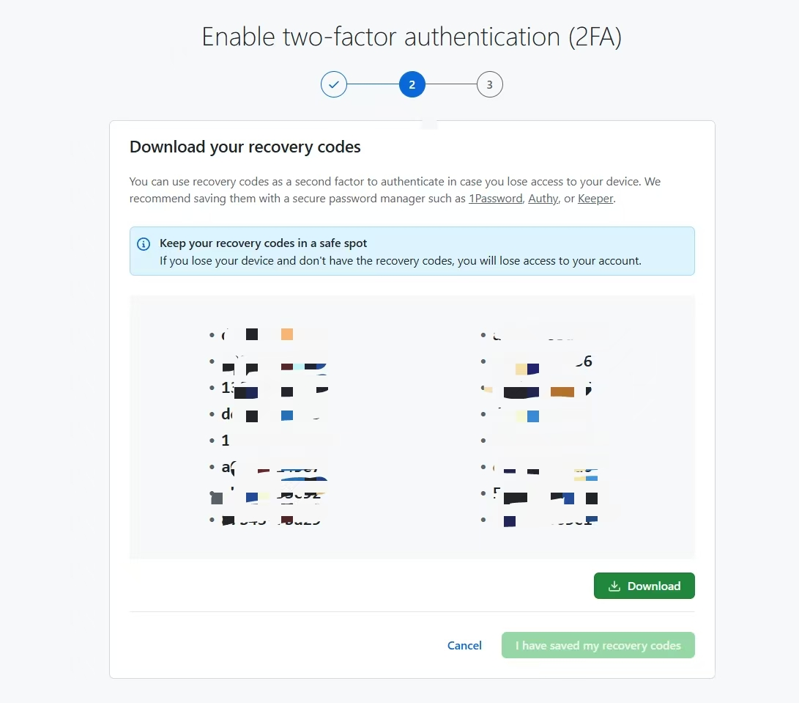

    &nbsp;&nbsp;&nbsp;&nbsp;&nbsp;&nbsp;&nbsp;&nbsp;点击右下角 **Download** 把恢复码下载并保存好。（这个是当认证软件失效时的备用验证方式，一旦丢失将会无法验证，务必好好保存！）再点击 **I have saved my recovery codes**即可

    5. 进入流程3，如果电脑有 Windows Hello 人脸识别或者指纹识别模块可以点击图中的 **Add a passkey** 方便以后登录

    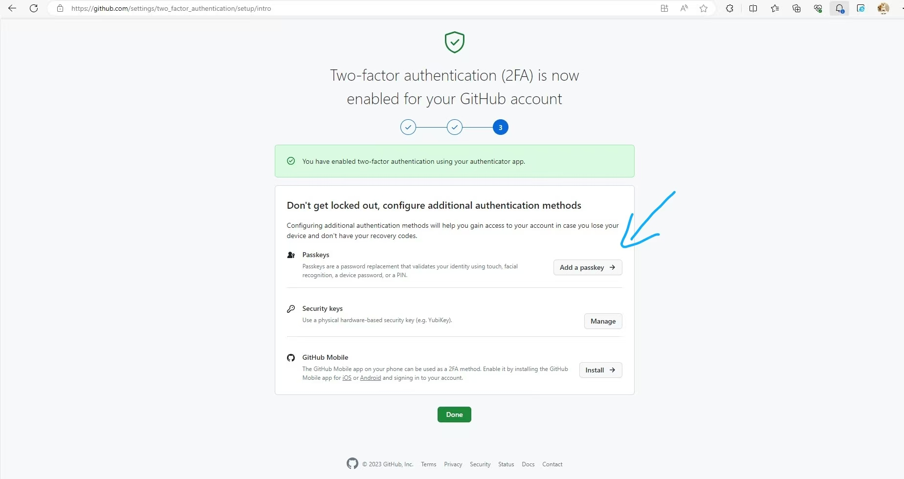

---

账号设置完成🎉

注意：账号信息设置完成之后请在所有设备退出 GitHub 然后再重新登录，从而更新信息

## 二、准备申请证明资料
GitHub提供的证明手段有：
- Dated school ID - Good （注明日期的学号 —— 证明效力强）
- Dated official/unofficial transcript （注明日期的成绩单 —— 证明效力一般）
- Dated enrollment letter or school letter head （注明日期的录取通知书或学校信头 —— 证明效力一般）

笔者自己试验过录取通知书，在学证明，成绩单。最后得出的结论是，为了提高通过率文件需要：
1. 有学校 Logo 和英文名称（如果只是书法体大学名可能无法被识别或准确翻译）
2. **包含自己的姓名和学号（学号可以提高通过率，没有学号的文件也可以试试），注有日期且没有被公章遮挡**
3. 信息量少，简洁（为了让上面的信息更显眼更易于识别）

笔者能找到的最符合上面条件的证明文件是学校开出的在学证明

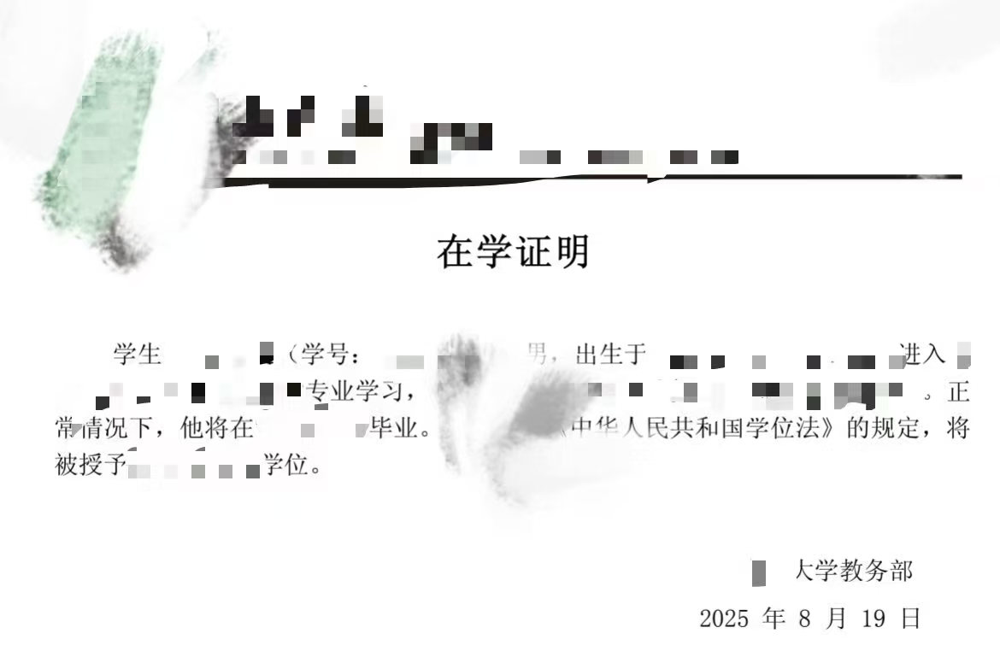

## 三、申请教育优惠  

注意：如果你的证明材料是电子版或电脑没有摄像头，请用手机登录 GitHub 完成下列操作（有拍照操作）。笔者这里推荐使用手机

前往[教育优惠申请](https://github.com/settings/education/benefits)页面

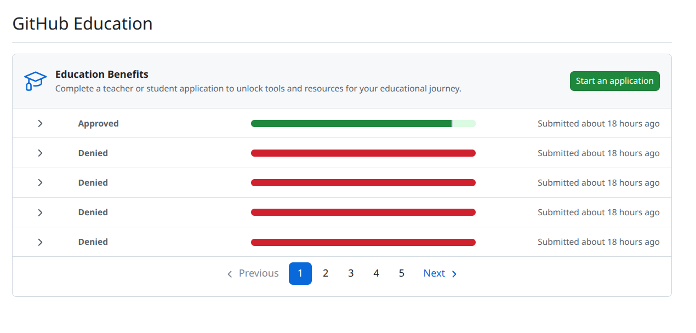

1. 点击 **Start an application** 开始认证

    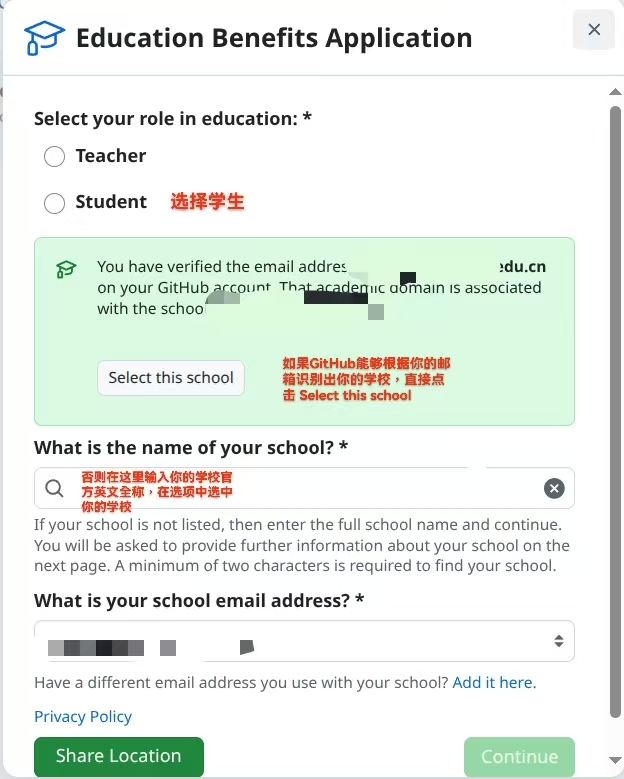

    如果没有列出你的学校，也请输入你的学校官方英文全称

2. 位置分享

    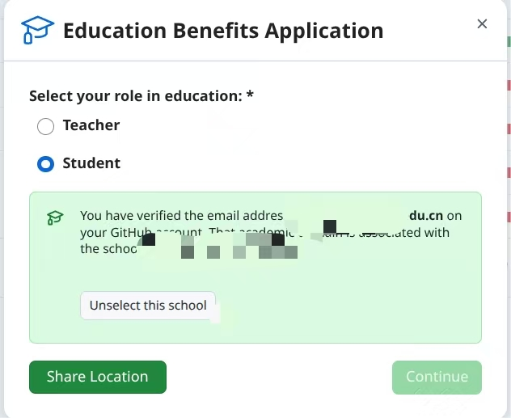

    
注意：点击 Share location 前请关闭科学上网**，分享完之后再开，然后点击 Continue

3. 上传文件
    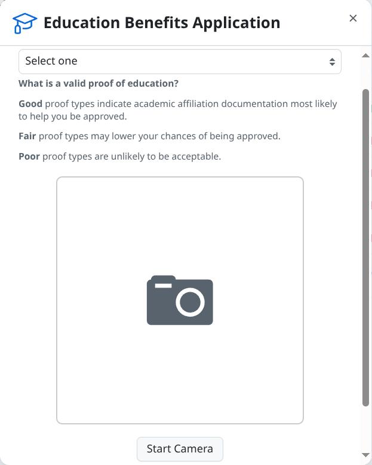

    如果你找到的证明文件包括学号，请选择第一个 **Dated scholl ID - Good**， 否则如实选择

    点击 **Start Camera**， 拍摄你的证明文件，注意尽可能地让名字和日期显眼一些，也要把学校的 Logo 拍进去

    上传之后点击 **Submit application**即可，等待2-3分钟。如果成功会显示**Approved**，否则是**Denied**，同时失败的话 GitHub 会发邮件到你的教育邮箱，告知你失败的原因。根据失败原因调整，重新提交申请，多试几次。（笔者试了20次😅，不过读者按上述操作的话应该能很快成功）

---

Tips: 如果刚刚没有列出你的学校，会进入以下页面

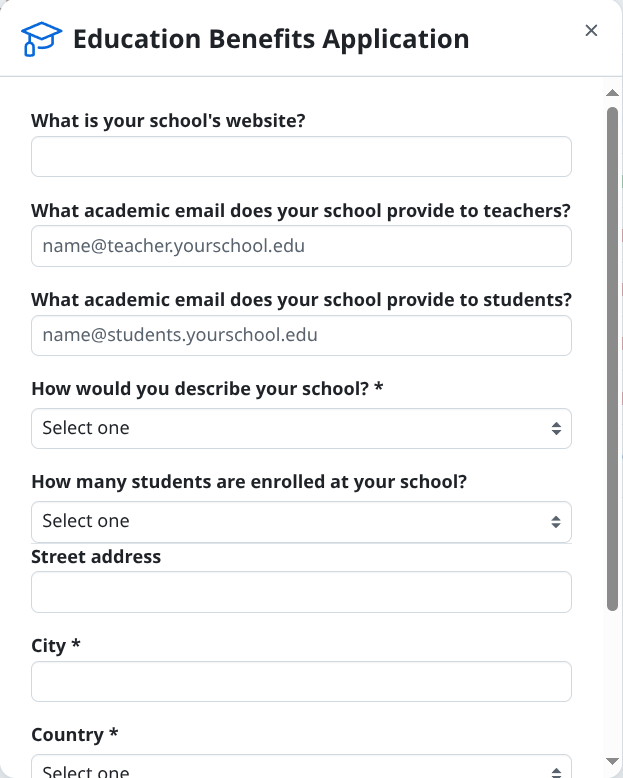

如实填写即可，填写完毕后点击 Continue

会进入以下界面：

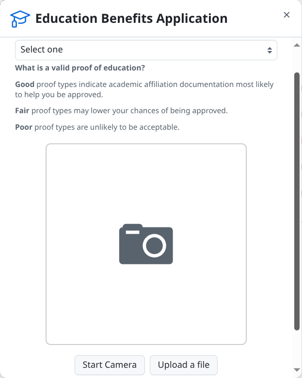

笔者没有进入过这个流程，不过建议准备多一些文件拼接在一起，点击 **Upload a file**，上传后点击 **Submit Application** 等待结果即可，不行就多试几次

---

申请流程到这里就结束了，如果最后 **Approved** 了，三天内会收到 GitHub 的邮件

## 四、激活Copilot
不出意外的话，你的教育邮箱会在三天后收到 GitHub 的邮件，提醒你的教育优惠已经到账。

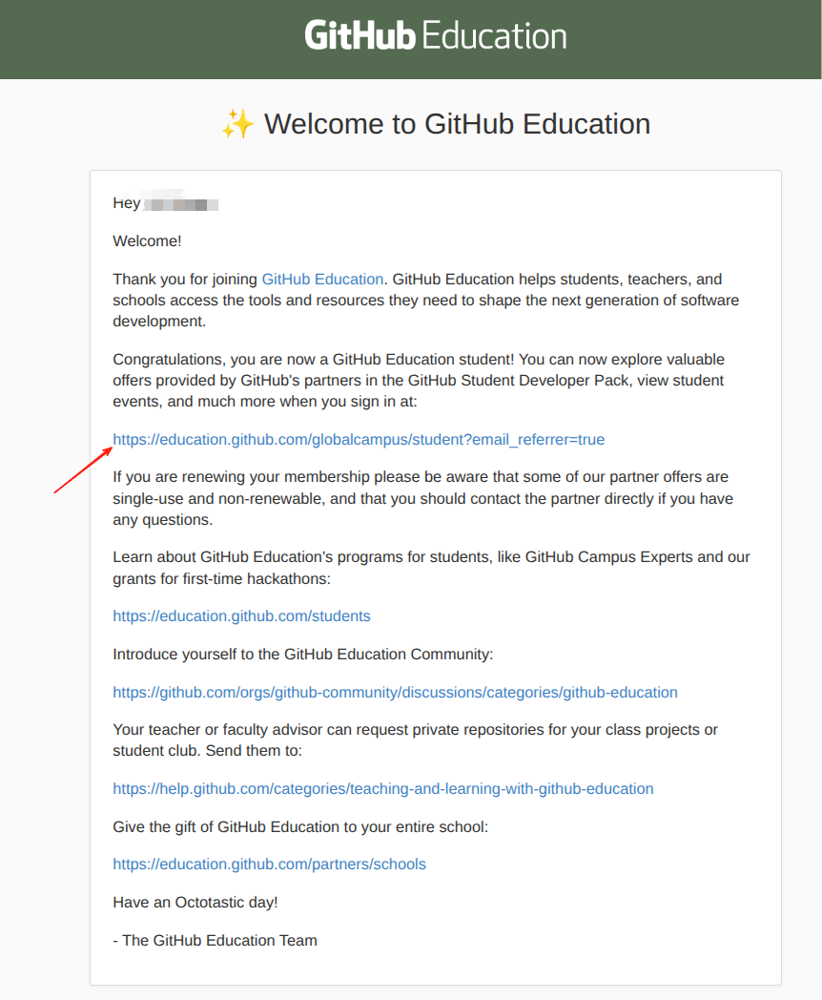

点击第一个链接，接下来会有两个问题，自行选择适合自己的即可

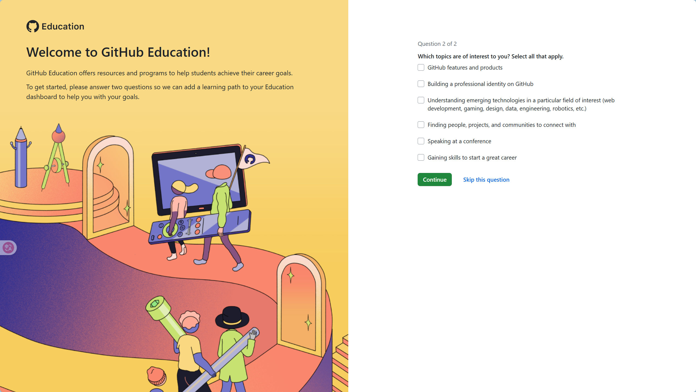

回答完问题之后，GitHub会推荐一个合适的学习路径，不重要，直接点击 Continue to Dashboard 即可

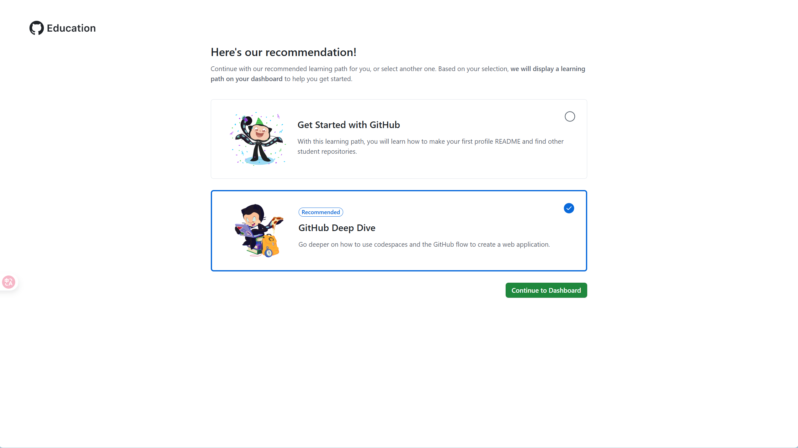

进入 Dashboard 之后，点击右上角 Learn more

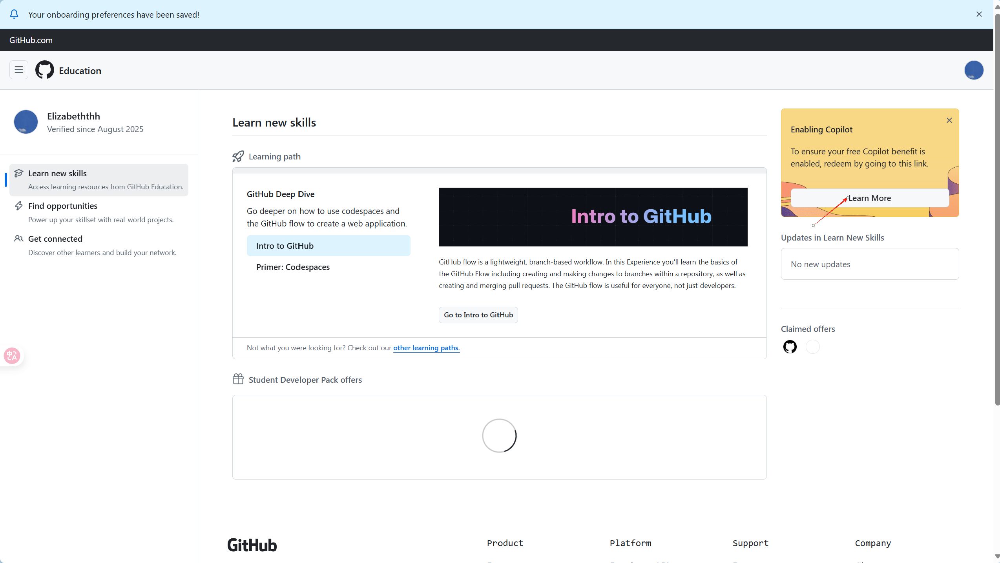

接着点击 Get access to GitHub Copilot

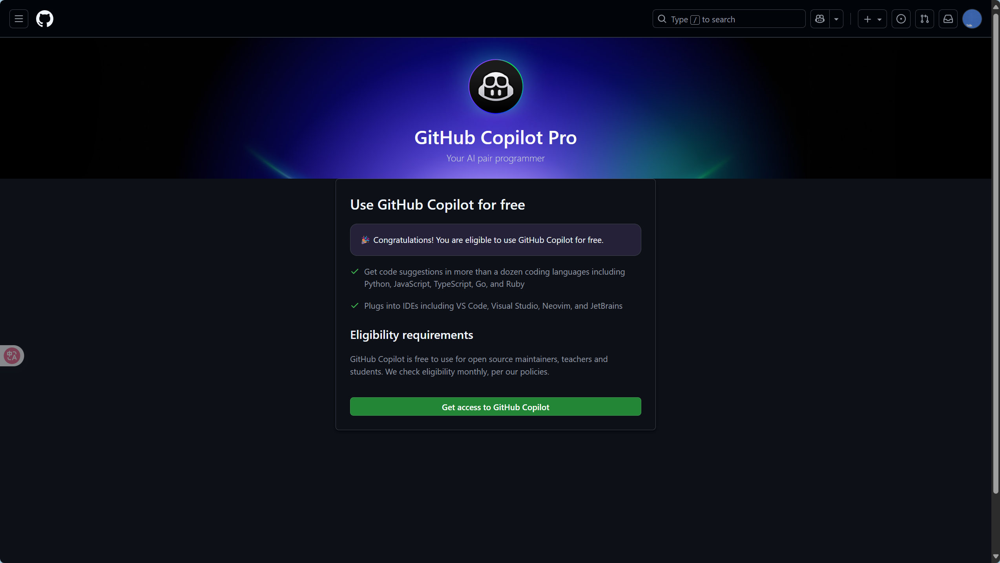

接着自己选择偏好即可：

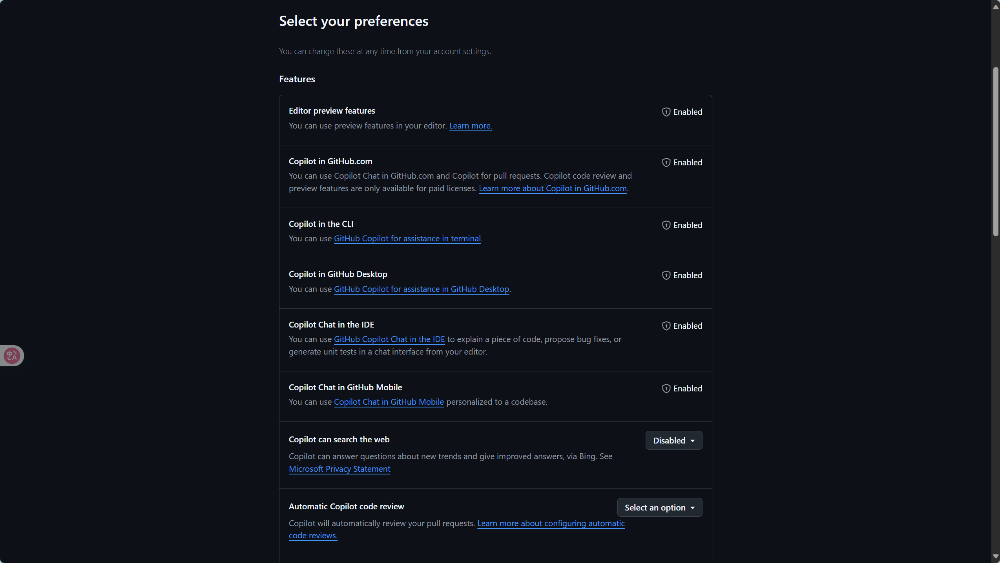

选择好之后点击下一步就完成设置啦，祝使用愉快！

## 五、2FA 认证移除
拿到优惠之后就可以移除 2FA 认证了，因为这个真的很烦人。
前往[密保设置](https://github.com/settings/security)，点击 2FA 认证右上角的三个点（如图）

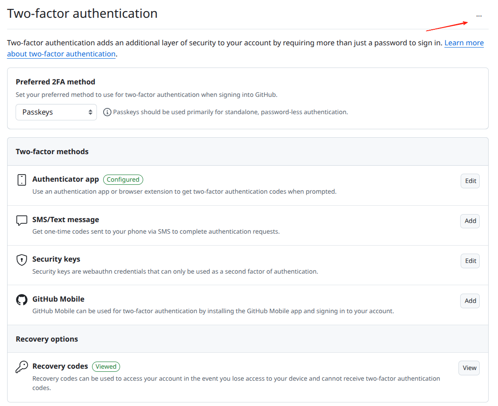

点击 Disable 即可
