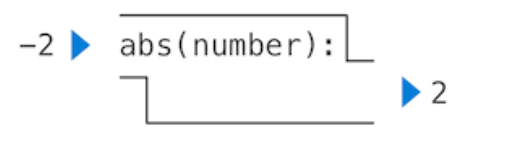
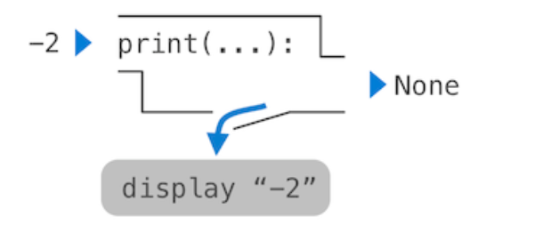

<font face=STkaiti><font size=4>
&nbsp;&nbsp;&nbsp;&nbsp;&nbsp;&nbsp;&nbsp;&nbsp;开始第一周的学习！在未来的日志里，我会将关注点放所学习到的编程思想上，而不是零零碎碎的语法知识。（当然也会记录一下Python核心/陌生概念，尽量简洁）编程语言有许多，语法也存在大大小小的差别。但是编程思想，或者说解决问题的哲学是通用的。学习计算机就是学习如何用编程思想解决问题。

## </font>Python之禅<font size=5>

***There should be one-- and preferably only one --obvious way to do it.***

## </font>语言知识<font size=5>
1. 在Python中赋值语句是将**名字**绑定到**值**的过程
```python
>>> radius = 10
>>> radius
10
>>> 2 * radius
20
```
`radius`被绑定到了值`10`

这种绑定还可以通过`import`语句来实现：
```python
>>> from math import pi
>>> pi * 71 / 223
1.0002380197528042
```

2. 解释器用来追踪**名字**、**值**与它们之间的**绑定**的内存就是**环境**

3. 函数有两种：调用时会产生副作用的和不会的，分别对应**Non-pure**和**Pure**

下面两幅图就能很形象地描述这种不同：  



4. 环境是一系列的栈帧
查找一个**名字**，会先在当前栈帧查找，如果没有找到，则依次到parent frames查找直到global frames

5. 断言语句：
```python
assert fib(8) == 13, 'The 8th Fibonacci number should be 13'
```
语法：断言关键字 表达式, 字符串
当表达式求值为`False`时，`assert`会cause an AssertionError，并将所给字符串显示。反之没有效果。

6. Doctests
python允许在Docstring里放置简单的测试，导入对应库即可
```python
def sum_naturals(n):
        """Return the sum of the first n natural numbers.

        >>> sum_naturals(10)
        55
        >>> sum_naturals(100)
        5050
        """
        total, k = 0, 1
        while k <= n:
            total, k = total + k, k + 1
        return total
```
```python
>>> from doctest import testmod
>>> testmod()
TestResults(failed=0, attempted=2)
```

或者写一个独立的函数来运行测试

```python
>>> from doctest import run_docstring_examples
>>> run_docstring_examples(sum_naturals, globals(), True)
Finding tests in NoName
Trying:
    sum_naturals(10)
Expecting:
    55
ok
Trying:
    sum_naturals(100)
Expecting:
    5050
ok
```

第一个参数是函数名；第二个是内置函数`globals()`，返回全局环境；最后一个是是否开启*verbose output*的布尔值  

### </font>高阶函数<font size=5>
高阶函数是指能够接收一个或多个函数作为参数，或者返回一个函数作为结果的函数。

7. 函数的柯里化(Currying)
把接受多个参数的函数变换成接受**单一参数**的函数  

```python
>>> def curried_pow(x):
        def h(y):
            return pow(x, y)
        return h 
>>> curried_pow(2)(3)
8
```
可以定义一个可以将其它函数（去）柯里化的函数：
```python
>>> def curry2(f):
        """Return a curried version of the given two-argument function."""
        def g(x):
            def h(y):
                return f(x, y)
            return h
        return g
>>> def uncurry2(g):
        """Return a two-argument version of the given curried function."""
        def f(x, y):
            return g(x)(y)
        return f
```
以上利用了函数可以作为返回值的特性

8. Lambda Expressions(匿名函数)
Lambda表达式的值是一个只有一条返回语句的函数，赋值和控制语句不允许在函数体内出现
```python
>>> def compose1(f, g):
        return lambda x: f(g(x))
```
| lambda           | x       | :           | f(g(x))  |
|------------------|---------|-------------|----------|
| A function that  | takes x | and returns | f(g(x))  |

9.  First-Class Functions（一等函数）
一等函数指在程序设计语言中，函数被当作一等对象。意味着函数可以
    1. 作为其他函数的参数
    2. 作为函数的返回值
    3. 绑定/赋值给变量
    4. 存储在数据结构中
在Python中，函数是一等对象

10. Decorators（装饰器）
```python
>>> def trace(fn):
        def wrapped(x):
            print('-> ', fn, '(', x, ')')
            return fn(x)
        return wrapped
>>> @trace
    def triple(x):
        return 3 * x
>>> triple(12)
->  <function triple at 0x102a39848> ( 12 )
36
```

实际上是做了：
```python
>>> def triple(x):
        return 3 * x
>>> triple = trace(triple)
```

## </font>编程思想<font size=5>
1. 绑定是最简单的抽象(abstraction)  
这种将数值抽象为有具体意义的概念的做法，可以让我们在思考问题时不必关心数据的多少，变化，从而简化思维过程。当然程序员要确保并维护**名字**与相对应的**数值**绑定

2. 定义函数的哲学
    - 每个函数应该负责一个具体的功能
    - ***DRY***原则：Don't repeat yourselves
    - 函数的功能应泛化——提高可复用性（例如定义`pow()`而不是只定义`square()`）

3. 及时对函数进行测试
有效测试的关键是对在实现了一个新函数之后马上对其进行测试，甚至是在实现函数之前就写好一些测试数据。
对一个函数的测试叫作单元测试（unit testing），良好的设计需要的单元测试。

4. 抽象
作为程序员，我们要有能够识别我们的程序中底层抽象的能力，并对其进行泛化以构建更强大的抽象。作为程序员，我们要选择适合任务的抽象级别。厕所脏了，在清理的时候把脏东西抽象碳氮等元素的有机组成显然是不合适的。解决具体的问题应该在具体、合适的抽象级别思考。

## </font>作业<font size=5>  
HW01, Lab00和hog都已完成，已经推送到github仓库：
[链接](https://github.com/Elizabeththh/cs61a)
