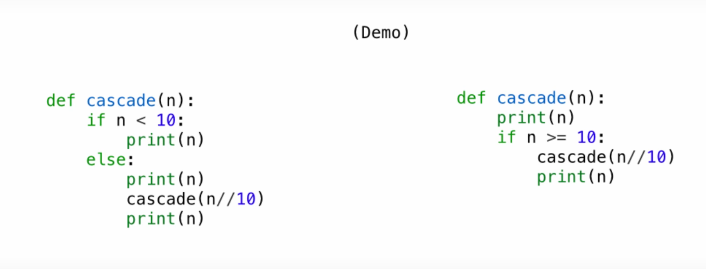

 
&nbsp;&nbsp;&nbsp;&nbsp;&nbsp;&nbsp;&nbsp;&nbsp;学习了第一周的内容。体会到为什么大家都说61a难了，第一周就讲了高阶函数，作业有HW01, Lab00和Hog。虽然我已经有了c和cpp的使用经验，但是在完成作业的过程中也遇到了不少的困难（尤其是hog项目）。与此同时，我也越来越能体会到使用python能带来的便利和简洁，在cpp中要四五行代码才能实现的功能，python一条推导式就能解决。所以希望我能把这门优雅的编程语言学好吧。

## Python之禅
***If the implementation is hard to explain, it's a bad idea.***

## 语言知识
这一周没有什么新的语法知识，更多的是和数据结构与递归有关的编程思想

## 编程思想

1. 递归
递归的本质是将复杂问题分解成更小的子问题求解的过程，关键在于：
   	1. 明确终止条件（base case）
	2. 如何利用**自相似**缩小问题规模（写出递归语句）

理论上，所有递归都能用迭代（循环）来完成，但是递归能帮助我们更好地理解问题求解过程，一般也更加简洁。但是在利用递归的时候需要注意*stack overflow*的可能。（比如斐波那契问题用递归解决会重复求解非常多的相同子问题，造成巨大的资源浪费）

2. 递归写法的选择  

图片中左右两个函数的递归是等价的。但是左边的写法更易读。程序员所写的程序，是给别人看的（当然也包括自己）。如果能以更简洁易读的方式设计程序，可以让程序更易于维护，**so please do ourselves a favor**。

## 作业
完成了hw02, lab02
[链接](https://github.com/Elizabeththh/cs61a)
