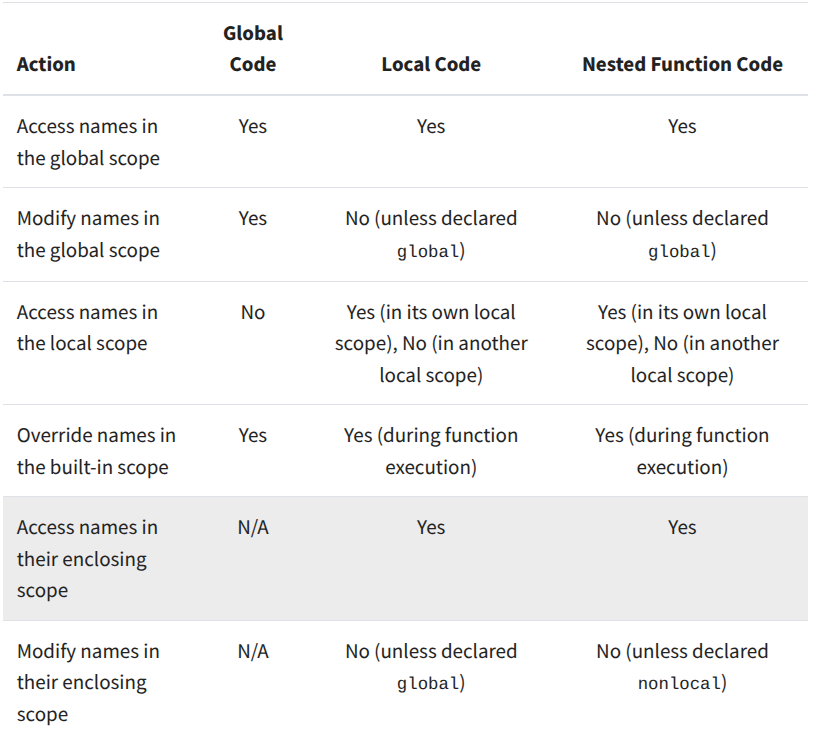

<font face=STkaiti><font size=5>
&nbsp;&nbsp;&nbsp;&nbsp;&nbsp;&nbsp;&nbsp;&nbsp;

## </font>Python之禅<font size=5>
***Now is better than never.***

## </font>语言知识<font size=5>
1. 可变数据与不可变数据
Python 中的数据分为可变与不可变，其中不可变数据类型指**对象一旦创建，其内容（值）就不能被修改**；可变数据类型指：**对象的内容（值）在创建后可以被修改，而不会导致对象的内存地址发生变化**。
	- 不可变数据类型（immutable）：
		1. `int`
		2. `string`
		3. `tuple`
	- 可变数据类型（mutable）：
		1. `list`
		2. `dict`
		3. `set`

对于可变数据，对一个名称调用的方法可以同时影响另一个名称。

```python
a = [1, 2, 3]
b = a
a.append(4)
>>> a
[1, 2, 3, 4]
>>> b
[1, 2, 3, 4]
```

2. 比较运算符
Python 中有两个比较运算符`is`,`is not`，用来测试两个表达式是否求值为同一个对象

```python
>>> a is [1, 2, 3, 4]
>>> False
>>> a == [1, 2, 3, 4]
>>> True
```

相同是比相等更强的条件

3.元组（tuple）
元组是内置类型，是不可变的序列。元组使用逗号分隔的元素表达式创建的元组字面量来创建。括号是可选的，但常用。任何对象都可以放在元组中。

空元组和单元素元组有特殊的字面量语法。

```python
>>> ()    # 0 elements
()
>>> (10,) # 1 element
(10,)
```

3. 字典（dict）
字典是 Python 的内置数据类型，用于存储和操作对应关系。字典包含键值对，其中键和值都是对象。用花括号创建

字典类型支持多种方法来整体迭代字典的内容。方法 `keys`、 `values` 和 `items` 都返回可迭代值  

字典也有类似于列表的推导式语法。键表达式和值表达式之间用冒号分隔。计算字典推导式会创建一个新的字典对象。

```python
>>> {x: x*x for x in range(3,6)}
{3: 9, 4: 16, 5: 25}
```

字典的限制：
	
- 字典的键不能是或包含可变值。
- 一个给定的键最多只能有一个值

5. LEGB Rule
Python 有四个作用域级别，分别是：  
	- Local scope
	- Enclosing scope
	- Global scope
	- Built-in scope

当引用一个给定的名称时，如果它们都存在，Python 会按顺序在局部、封闭、全局和内置作用域级别中查找该名称。如果 Python 找到该名称，你将得到它的第一个或最内层的出现。否则，你将得到一个 NameError 异常。



Python 提供了两个关键字，允许修改全局和非局部名字的内容：
- global 

```python
>>> counter = 0  # A global variable

>>> def update_counter():
...     global counter  # Declares 'counter' as a global variable
...     counter = counter + 1  # Successfully updates 'counter'
...

>>> update_counter()
>>> counter
1
>>> update_counter()
>>> counter
2
>>> update_counter()
>>> counter
3
```

- nonlocal

```python
>>> def function():
...     number = 42  # A nonlocal variable
...     def nested():
...         nonlocal number  # Declare 'number' as nonlocal
...         number += 42
...     nested()
...     print(number)
...

>>> function()
84
```

更详细的介绍在[LEGB Rule in Python](https://realpython.com/python-scope-legb-rule/)

## </font>编程思想<font size=5>
一、 抽象（abstraction）
&nbsp;&nbsp;&nbsp;&nbsp;&nbsp;&nbsp;&nbsp;&nbsp;1. 数据抽象  
&nbsp;&nbsp;&nbsp;&nbsp;&nbsp;&nbsp;&nbsp;&nbsp;将程序中处理数据表示和数据操作的部分分离开的方法，叫作***数据抽象***（data abstraction）  
数据抽象和函数抽象很相似。在实现函数抽象时，我们可以将函数的使用方式与其实现细节分离，程序员值需要考虑传入的数据和返回数据之间的关系即可。用乘车来类比，只需要买一张从X地到Y地的票即可实现目的，不需要关注客运网络的实现方式。类似的，数据抽象是将数据的用法和构造细节分离。

&nbsp;&nbsp;&nbsp;&nbsp;&nbsp;&nbsp;&nbsp;&nbsp;2. 抽象屏障（abstraction barriers）  
&nbsp;&nbsp;&nbsp;&nbsp;&nbsp;&nbsp;&nbsp;&nbsp;以有理数为例，用列表来实现有理数，并定义了一系列函数：  
&nbsp;&nbsp;&nbsp;&nbsp;&nbsp;&nbsp;&nbsp;&nbsp;i. `add_rational` `mul_rational`等。这些函数有较高的抽象层次调用，以较低的抽象层次实现。
&nbsp;&nbsp;&nbsp;&nbsp;&nbsp;&nbsp;&nbsp;&nbsp;ii. `make_rational()`传入numerator和denominator用来构造一个有理数

&nbsp;&nbsp;&nbsp;&nbsp;&nbsp;&nbsp;&nbsp;&nbsp;如果要计算两个有理数的乘积，却使用了较低抽象层次的函数就会发生**abstraction barrier violation**。为了避免这种情况应该调用`add_rational`，即较高层次的调用不应该考虑任何有理数的实现细节

例子：

```python
>>> def square_rational(x):
        return mul_rational(x, x)
```

直接引用分子和分母将违反一个抽象层

```python
>>> def square_rational_violating_once(x):
        return rational(numer(x) * numer(x), denom(x) * denom(x))
```

假设有理数表示为两元素列表将违反两个抽象屏障。

```python
>>> def square_rational(x):
        return mul_rational(x, x)
```

&nbsp;&nbsp;&nbsp;&nbsp;&nbsp;&nbsp;&nbsp;&nbsp;**抽象屏障使程序更易与维护和修改**。依赖于特定实现方式的函数越少，当需要改变时某些细节时所导致的变化就会越少。以上函数中只有最后一个对未来的变化具有鲁棒性——即使改变有理数的实现方式也不需要更新函数

二、 对象（object）

**为数据添加状态是面向对象编程范式的一个核心要素**。对象结合了数据和行为。对象既是信息也是过程，捆绑在一起以表示复杂事物的属性、交互和行为。

## </font>作业<font size=5>
完成了 hw03，lab03 和 cats

在完成作业的时候学习了两个在搜索算法中很重要的实现：

1. 剪枝 —— 通过某种判断，减少搜索过程中不必要的遍历
2. 记忆化搜索 —— 通过记录已经遍历过的状态的信息，从而避免对同一状态重复遍历的搜索实现方式

cats 这个项目中的 `final_diff()` 很好的体现了这两点：

```python
def final_diff(typed, source, limit):
    """A diff function that takes in a string TYPED, a string SOURCE, and a number LIMIT.
    If you implement this function, it will be used."""
    
	# 记忆化搜索
    # 在递归过程中使用字典存储，键：某一参数状态 值：这一参数状态对应的结果
	# 可以有效避免递归过程中的重复计算，提高性能
    memo = {}
    
    def helper(typed, source, limit):
        
        key = (typed, source, limit)  # 当前递归的参数状态
        if key in memo:
            return memo[key]
       
	   # 剪枝，当limit小于0时，就没有必要再进行下去了，剪掉这个枝条
        if limit < 0:
            return limit + 1
        if typed == source:
            return 0
        if len(typed) == 0:
            return len(source)
        if len(source) == 0:
            return len(typed)
            
        if typed in common_typos.get(source, []):
            memo[key] = 1  # 更新记忆
            return 1
        
        if typed[0] == source[0]:
            result = helper(typed[1:], source[1:], limit)
            memo[key] = result  # 更新记忆
            return result
        
        operations = []

        if (len(typed) > 1 and len(source) > 1 and 
            typed[0] == source[1] and typed[1] == source[0]):
            operations.append(1 + helper(typed[2:], source[2:], limit - 1))
        
        if typed[0] in adja_typos.get(source[0], []):
            typo_cost = 0.3
            operations.append(typo_cost + helper(typed[1:], source[1:], limit - typo_cost))
        elif source[0].lower() in adja_typos.get(typed[0].lower(), []):
            typo_cost = 0.3
            operations.append(typo_cost + helper(typed[1:], source[1:], limit - typo_cost))
        

        operations.extend([
            1 + helper(typed, source[1:], limit - 1),     
            1 + helper(typed[1:], source, limit - 1),     
            1 + helper(typed[1:], source[1:], limit - 1)  
        ])
        
        result = min(operations)
        memo[key] = result  # 更新记忆
        return result
    
    return helper(typed, source, limit)

```

[链接](https://github.com/Elizabeththh/cs61a)
