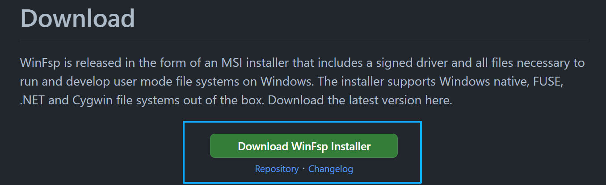
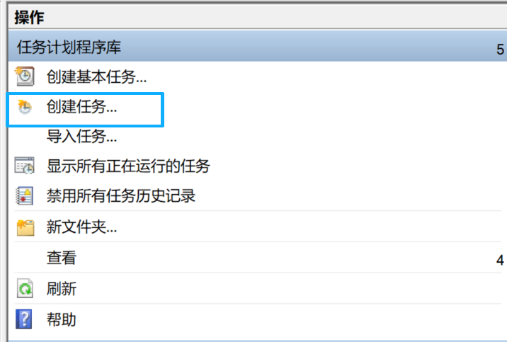
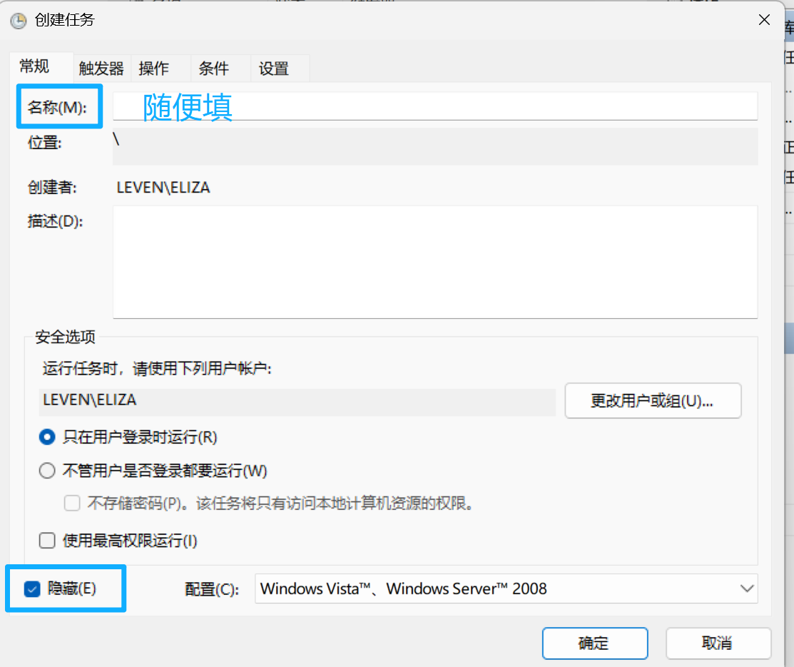
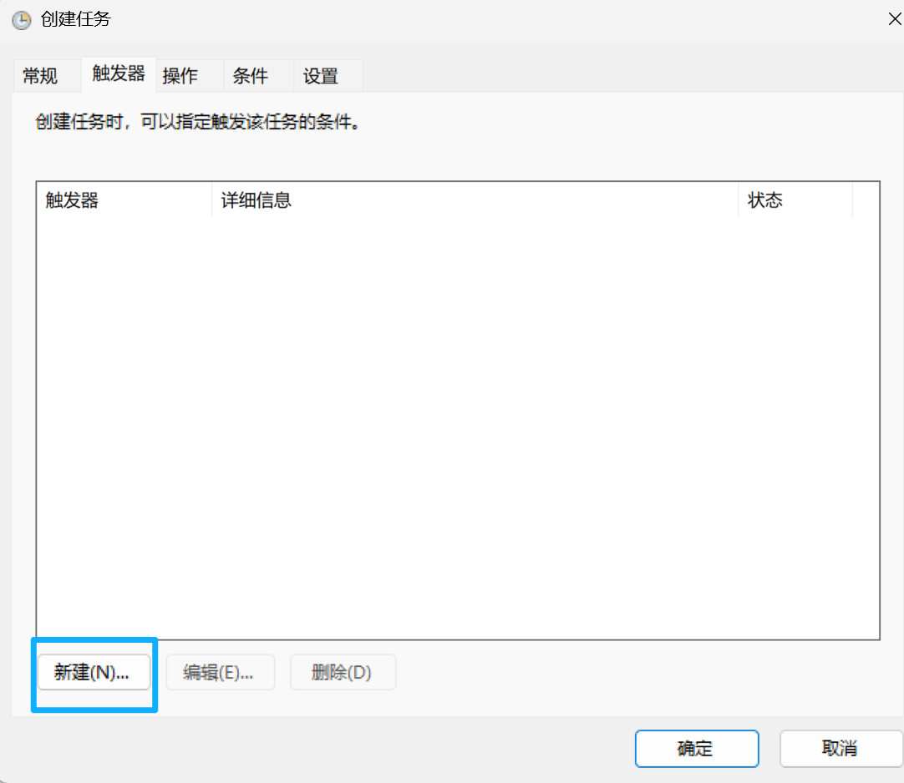
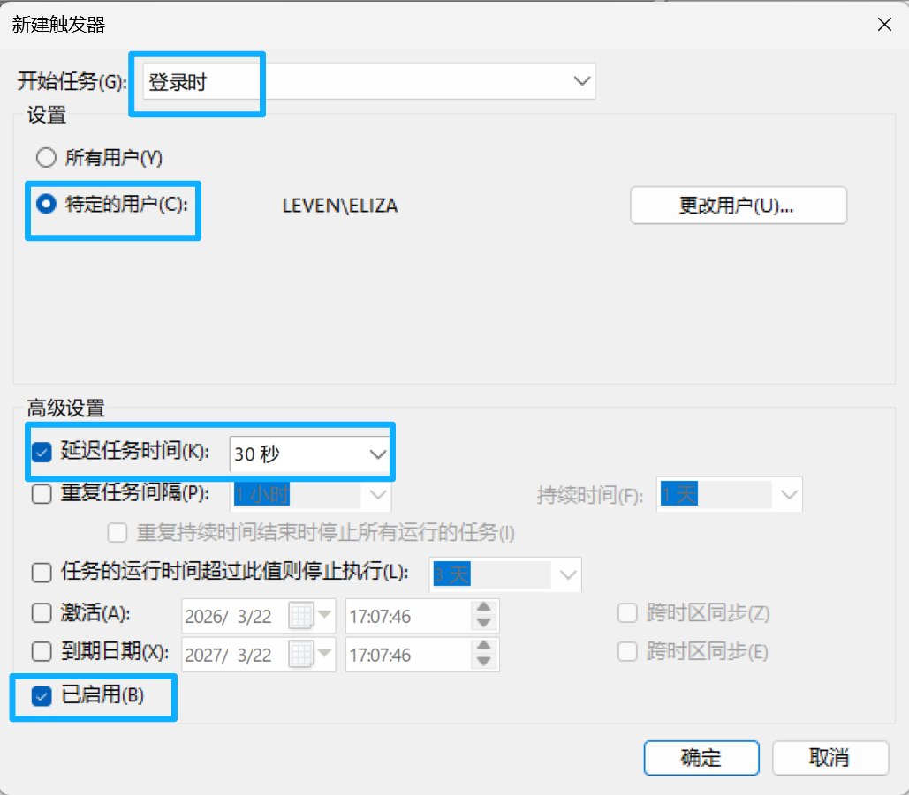
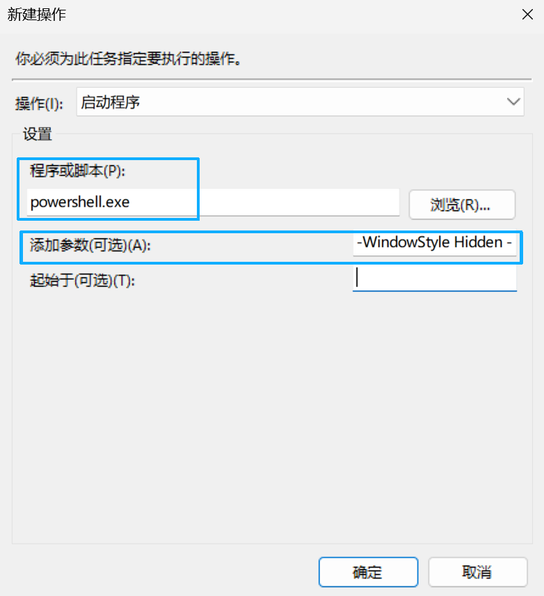
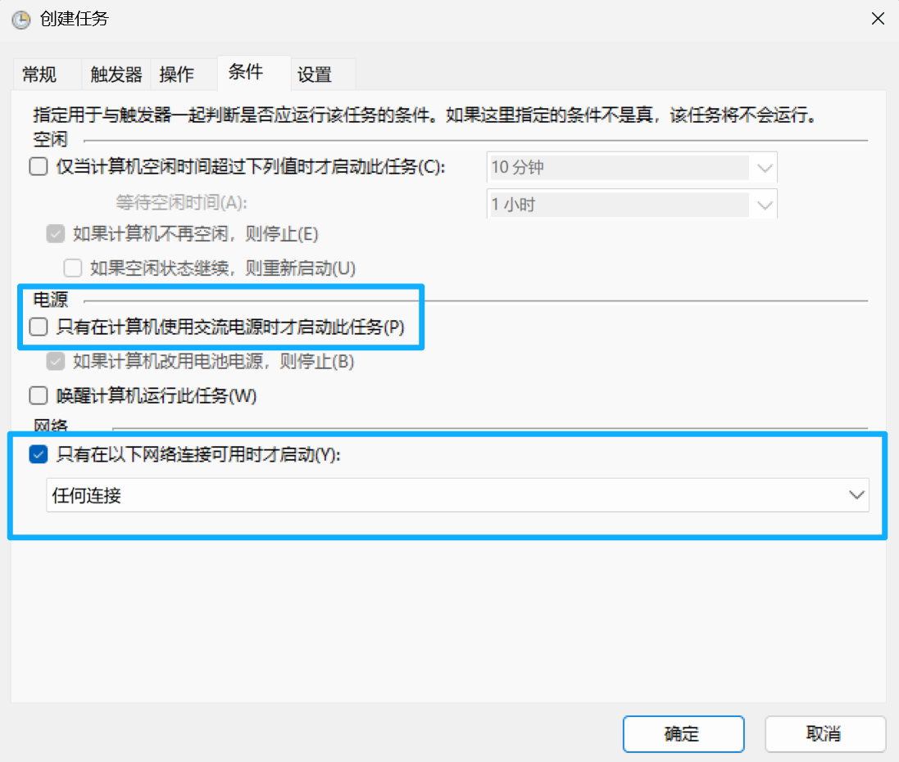
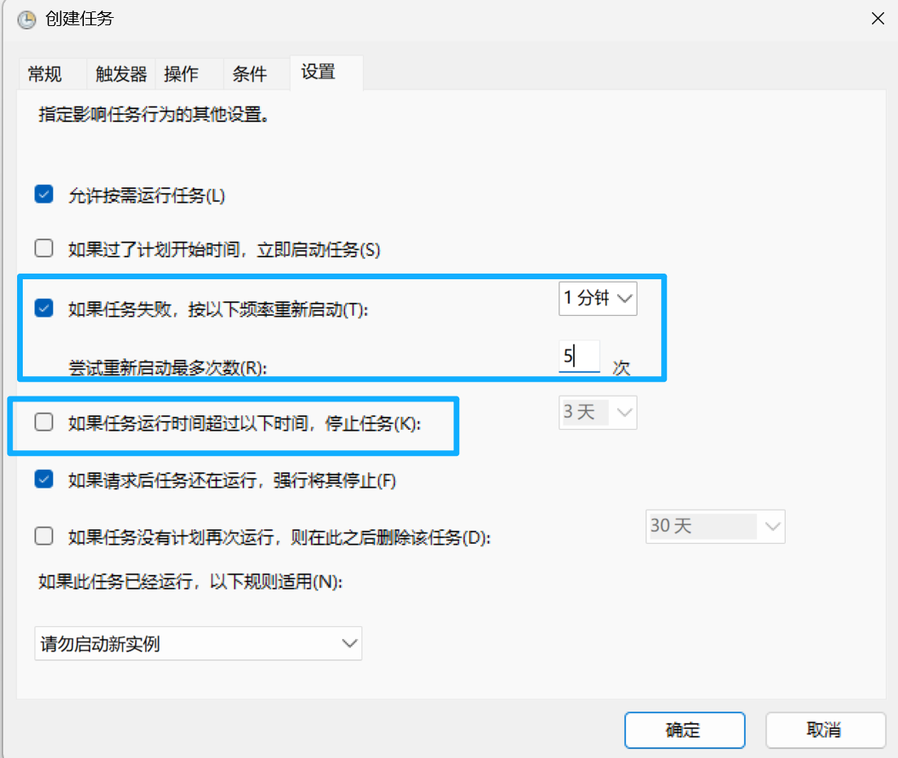

# 使用 WinFsp 和 Rclone 实现 Windows 和 Linux 文件共享

最近写实验报告等文档工作经常需要在 Windows 笔记本和实验室 Linux 主机交换文件（主要是截图），今天终于受不了敲 `scp` 命令了，所以探索了一个用 **WinFsp** 和 **Rclone** 实现两个系统间文件共享的方案。这下远程 Linux 裸机开发的文件共享的问题彻底解决了，可以再也不用傻缺的 WSL 了

## 前置条件
1. [**WinFsp**](https://winfsp.dev/rel/)



2. [**Rclone**](https://rclone.org/downloads/)

自行选择合适版本下载

3. 确保两台机器之间能够建立 SSH 连接

## 配置 SSH 隧道与端口转发
编辑 Windows 下的 `~/.ssh/config` 文件。在目标节点的配置中，将本地端口（如 2222）转发到远端的 22 端口，这样可以将读写文件的请求通过 SSH 隧道转发到远程主机

示例配置：
```conf
# 目标节点
Host Lab
  Hostname xxx
  User your_user_name

  # 将本地 2222 端口流量转发至远端 22 端口
  LocalForward 2222 127.0.0.1:22

  ServerAliveInterval 60
  ServerAliveCountMax 3
```

## 配置 Rclone
在 Rclone 程序同级目录下创建配置文件 `rclone.conf`。配置 Rclone 直接挂载本地暴露出的 2222 端口（建立 SSH 连接之后，访问本地 2222 端口即通过 SSH 访问远程主机）

```conf
[lab]
type = sftp
host = 127.0.0.1
port = 2222
user = your_user_name
key_file = path/to/your/identity/file
shell_type = unix
md5sum_command = md5sum
sha1sum_command = sha1sum
```

## 编写静默挂载脚本
创建 PowerShell 脚本 `Mount-Lab.ps1`（名字什么的随便啦）。该脚本负责清理历史进程、建立后台隧道，并执行挂载命令。

```powershell
# E:\apps\rclone\Mount-Lab.ps1

# 清理可能残留的挂载进程
Stop-Process -Name "rclone" -Force -ErrorAction SilentlyContinue

# 启动 SSH 隧道（-N 仅转发端口，不执行远端命令）
Start-Process -FilePath "ssh.exe" -ArgumentList "-N lab" -WindowStyle Hidden

# 等待隧道建立
Start-Sleep -Seconds 3

# 执行 Rclone 挂载
$rclone_exe = "E:\apps\rclone\rclone.exe"
$config_path = "E:\apps\rclone\rclone.conf"

# 将远端 /home/eliza 挂载至本地 Z: 盘，注意这里 mount 命令后的 lab 要与 rclone.conf 里定义的名称保持一致。只挂载自己的用户目录最好，你也不想手残删掉根目录对吧
Start-Process -FilePath $rclone_exe -ArgumentList "mount lab:/home/eliza Z: --config ""$config_path"" --vfs-cache-mode writes --dir-cache-time 15s" -WindowStyle Hidden
```

- `--vfs-cache-mode writes` 指 **WinFsp** 拦截的写入请求会先被 Rclone 缓存到 Windows 的本地临时目录，待文件句柄关闭后，再异步同步到远程主机
- `--dir-cache-time 15s` 目录结构缓存设为 15s，确保远程主机进行文件的增删时 Windows 能够快速更新。不设成更短的时间区间是因为，目录结构同步的请求延迟高，越短性能开销越大

## 配置系统开机静默自启
利用 Windows 任务计划程序实现登录后自动挂载：

1. 按下`Win` + `R` 输入 `taskschd.msc` 启动任务计划程序，点击右侧的 **创建任务**



2. **常规** 标签页：勾选底部的 **隐藏**



3. **触发器** 标签页：新建触发器，开始任务选择 **登录时**，勾选 **延迟任务时间** 并输入 `30 秒`（这是为了确保系统底层网络栈已完全初始化）





4. **操作** 标签页：新建操作，程序填入 `powershell.exe`，参数填入：
   `-WindowStyle Hidden -ExecutionPolicy Bypass -File "E:\apps\rclone\Mount-Lab.ps1"`



注意 `-File` 参数后要换成脚本所在的正确路径

5. **条件** 标签页：取消勾选“只有在计算机使用交流电源时才启动此任务”，勾选“只有在以下网络连接可用时才启动”，选择“任何连接”



6. **设置** 标签页：取消勾选“如果任务运行时间超过以下时间，停止任务”，勾选“如果任务失败，按以下频率重新启动”（每一分钟，五次）



保存设置并重启系统。登录后等待 30 秒，就可以在资源管理器中会出现映射好的 Z: 盘啦
