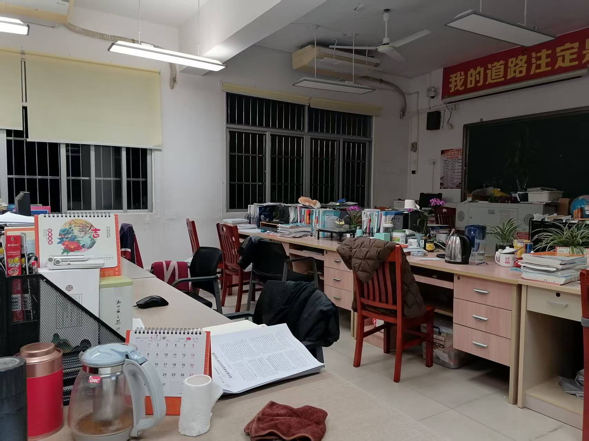
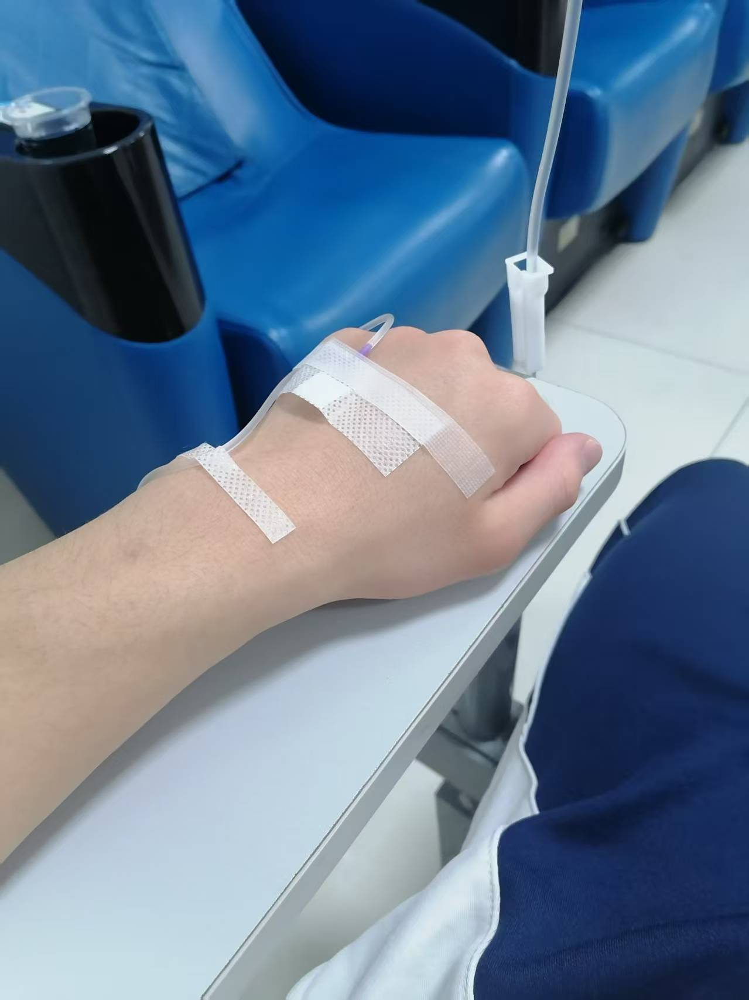
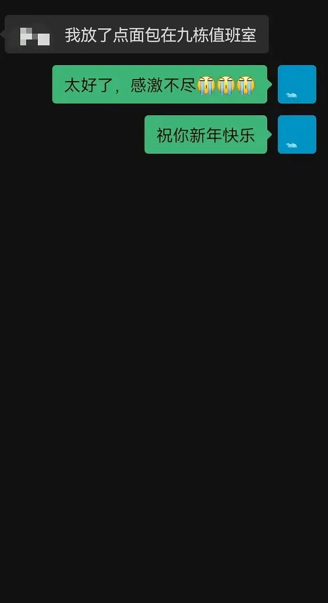

&nbsp;&nbsp;&nbsp;&nbsp;&nbsp;&nbsp;&nbsp;&nbsp;12月31日，本是应该考完试开开心心回家去的我，因为不想坐车所以留在了学校。早上吃完早餐之后就开始咳嗽了，这时的我还没有意识到问题的严重性，考完试后甚至还和同学去打了一个小时的球。午饭是在学校外面吃的，一碗重庆小面。然后在回宿舍的路上顺便买了些零食。在宿舍睡了午觉后就去教室写作业了。不幸的是，写完数学作业的我正准备把前几天没有写完的化学作业拿出来写，可是怎么找也找不到，甚至聚宝盆（教室后门专门存放废弃资料，回收后换班费的箱子）里也没有。于是只好去办公室找化学老师要。

&nbsp;&nbsp;&nbsp;&nbsp;&nbsp;&nbsp;&nbsp;&nbsp;化学老师是个特别勤奋的老师，经常能看见她在空无一人的办公室里默默工作，让我特别钦佩。我不好意思直接开口就问资料，于是和老师聊了会天，这一聊就是一个半小时，主要也是因为老师特别能唠嗑哈哈哈。等到老师要下班回家的时候，我才和她说了资料不见的事，她马上就给我打了一份。然后老师回家了，我到外面吃了晚饭，仍然是重庆小面。这时候我还是没有觉得身体有什么很大的问题。直到洗完澡之后觉得头有些沉重，我还是以为只是着凉了，所以就到教室去学习了。在教室学习的话，我害怕被班主任看到监控之后发到家长群，我不喜欢这样，所以就到老师办公室写作业了。

&nbsp;&nbsp;&nbsp;&nbsp;&nbsp;&nbsp;&nbsp;&nbsp;学到十点左右就回宿舍了，这时候阿潘给我打了个电话，挂电话的时候已经是11：40了。这时我已经在发着高烧，头特别特别晕。可是我不想麻烦宿管，也不想让爸妈担心。就想着捱到早晨自己一个人去看，可是头很晕怎么也无法入睡。到了半夜两点半我终于受不了了，就找了宿管带我去医院。急诊科的医生没有测出我的甲流，诊断出来是急性上呼吸道感染，开了几瓶针水和一针屁股针。打完的时候已经是早晨六点了。

&nbsp;&nbsp;&nbsp;&nbsp;&nbsp;&nbsp;&nbsp;&nbsp;回到宿舍之后就开始补觉，一直睡到了12点，又开始发烧了，想吃药可是又没有吃饭。本来不想影响大家过新年心情的我迫于无奈还是发了一条朋友圈问谁在宿舍有面包。没想到最后是一位高一时同班的不太熟的同学远道送面包到宿舍楼下，真的好感动好感动，我应该会记住一辈子的吧

&nbsp;&nbsp;&nbsp;&nbsp;&nbsp;&nbsp;&nbsp;&nbsp;吃完面包之后吃了退烧药，烧又退下去了
