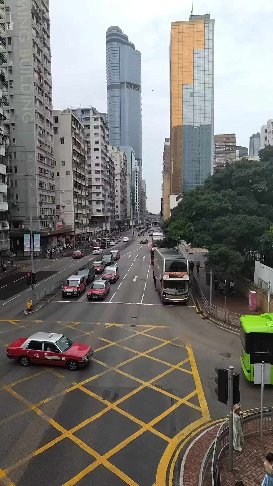
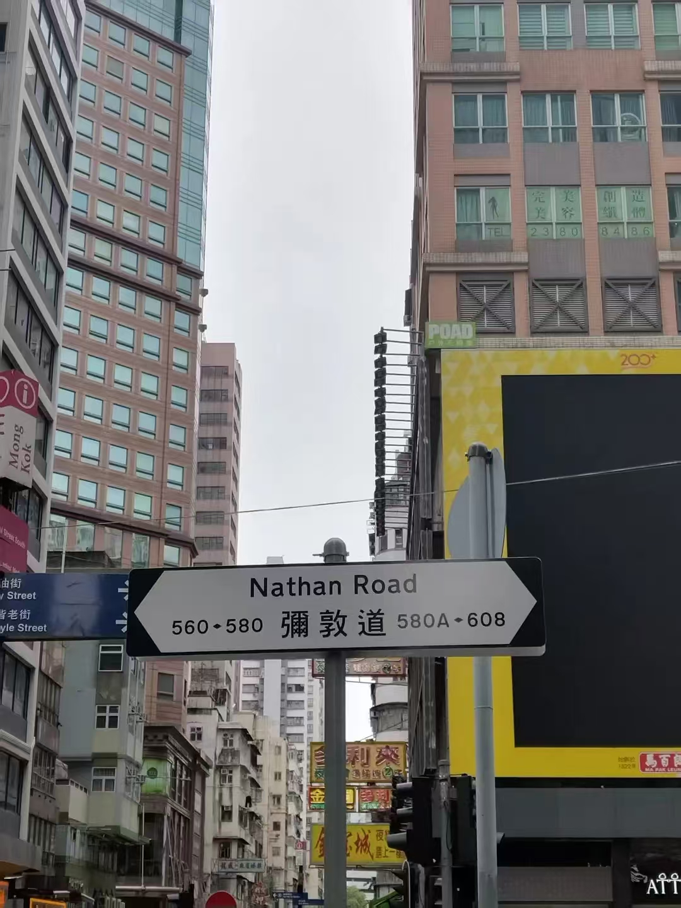
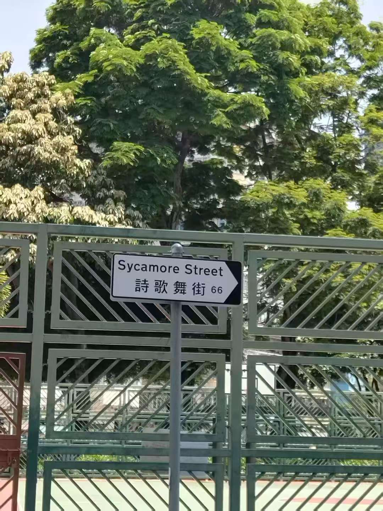
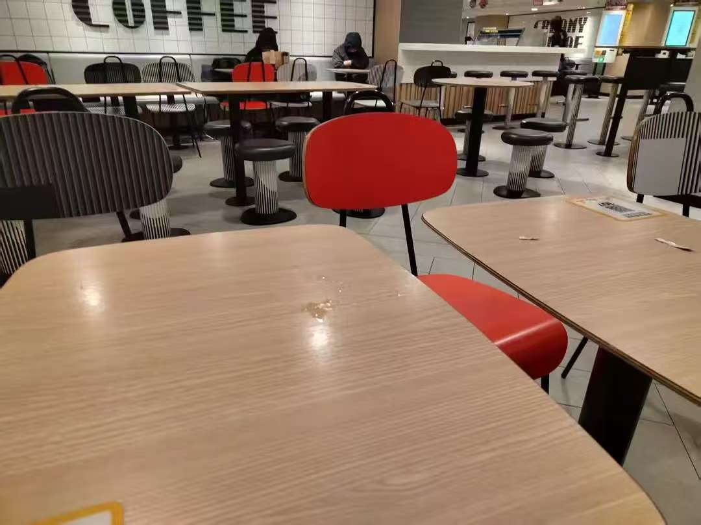
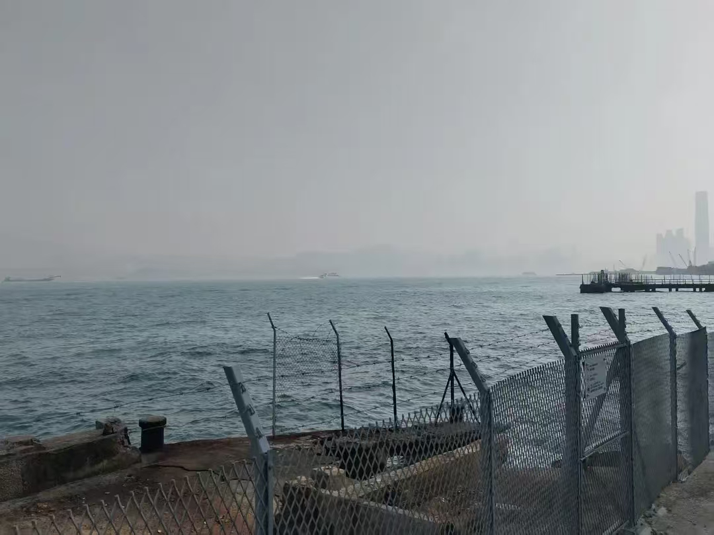
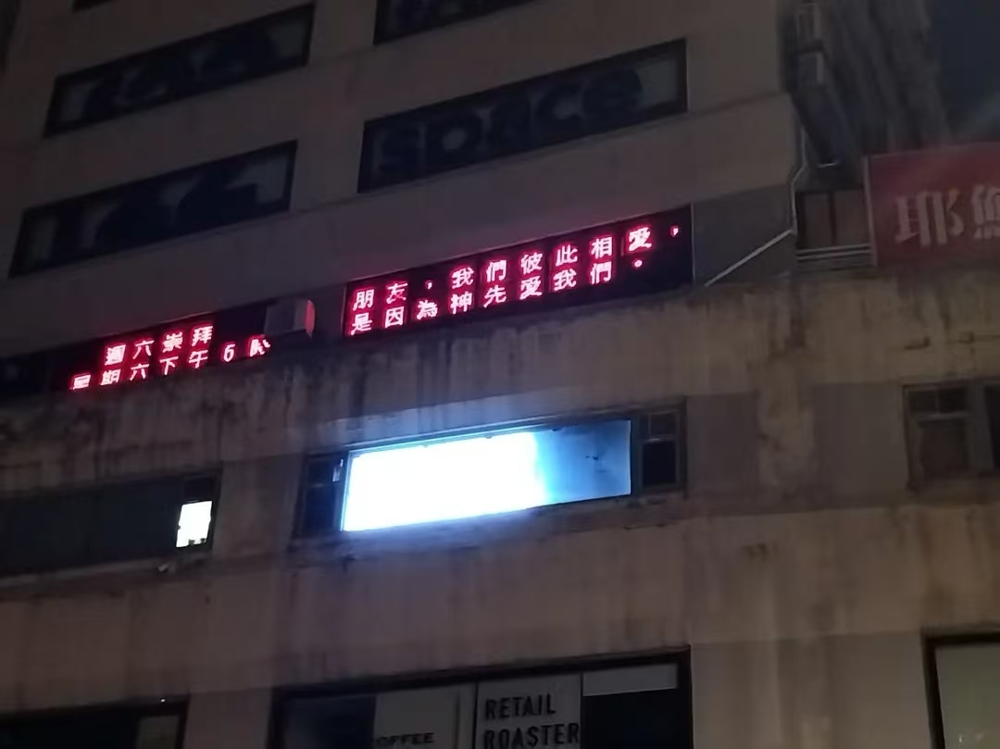
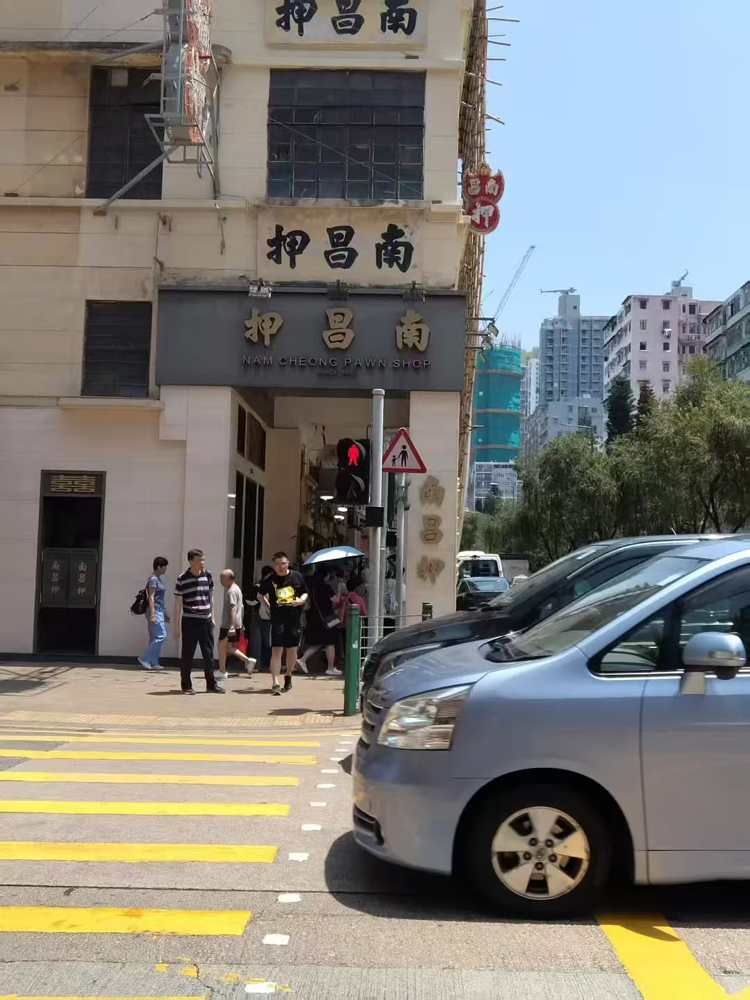
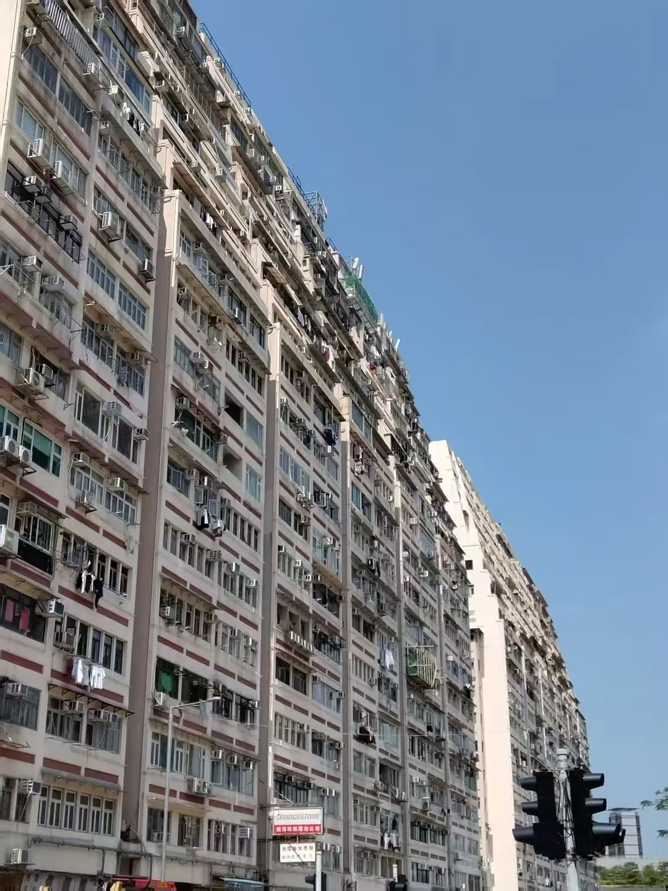

&nbsp;&nbsp;&nbsp;&nbsp;&nbsp;&nbsp;&nbsp;&nbsp;五一终于有兴致出门远行，第一站就是香港。

&nbsp;&nbsp;&nbsp;&nbsp;&nbsp;&nbsp;&nbsp;&nbsp;走出旺角东地铁站，站在人行天桥上，看到的第一眼香港给我留下的印象是远。红色的巴士，柏油道和双层巴士。居民楼窗台上悬挂衣服的景象在我十八线小县城的家乡也很少见了，种种这些景象都离我好远。远处几座写字楼的玻璃幕墙竟然没有显得很突兀。

&nbsp;&nbsp;&nbsp;&nbsp;&nbsp;&nbsp;&nbsp;&nbsp;第二个印象是觉得香港对地名的音译特别有意思。看到的第一个路牌是窝打老道(Waterloo Road)。

&nbsp;&nbsp;&nbsp;&nbsp;&nbsp;&nbsp;&nbsp;&nbsp;然后是弥敦道。

&nbsp;&nbsp;&nbsp;&nbsp;&nbsp;&nbsp;&nbsp;&nbsp;还看到不少很有意思的，基本没有拍下来。其中最喜欢的是诗歌舞街。

&nbsp;&nbsp;&nbsp;&nbsp;&nbsp;&nbsp;&nbsp;&nbsp;是的就是 mla 那首歌里的诗歌舞街。我没有“按图索骥”，是在找一家唱片店的途中不经意间路过。看到了才知道原来诗歌舞是sycamore的音译，不自觉地想起了一首歌「Dream a Little Dream of Me」，歌中有一句歌词是 ''Birds singing in a sycamore tree''。和朋友聊起这个街名，上网查了一下，发现了一个蛮有意思的故事。上个世纪二十年代港英政府想用植物给大角咀的几条街道命名，有一条街道就被命名成了Sycamore Street，sycamore是梧桐木。sycamore也可作无花果树解，官员在翻译这个地名的时候觉得「无花果」的寓意不吉利，便改为音译，于是就有了诗歌舞街。

&nbsp;&nbsp;&nbsp;&nbsp;&nbsp;&nbsp;&nbsp;&nbsp;第三个印象是贵，所有的东西售价都是大陆正常价格两倍起步。

&nbsp;&nbsp;&nbsp;&nbsp;&nbsp;&nbsp;&nbsp;&nbsp;为了节省预算，我没有订酒店（现在想想，青旅也不会很贵。麦当劳的空调太冷），找了一家二十四小时的麦当劳过夜。

&nbsp;&nbsp;&nbsp;&nbsp;&nbsp;&nbsp;&nbsp;&nbsp;捱到五点半醒过来，完全没有继续睡下去的欲望，于是点了一份五十港币的天价早餐，吃完坐叮叮车去坚尼地城。  

&nbsp;&nbsp;&nbsp;&nbsp;&nbsp;&nbsp;&nbsp;&nbsp;早晨的坚尼地城没有游客，只有零星的居民在散步遛狗。天气很晴朗，海上隐隐的雾气还没有散去，海蓝得令人着迷。

&nbsp;&nbsp;&nbsp;&nbsp;&nbsp;&nbsp;&nbsp;&nbsp;还有一些照片

&nbsp;&nbsp;&nbsp;&nbsp;&nbsp;&nbsp;&nbsp;&nbsp; 还有不得不谈的是，一号下午在香港到处逛，看到每一个人行天桥的两边都被席地而坐的菲佣占据了。出于尊重，我没有影相，但我相信每个第一次看这样景象的人都会讶异。听朋友说，她们一周只放一天假，按照香港法律，雇主必须给菲佣提供住所。可是大部分雇主只给她们提供逼仄的三到四平米的生活空间，所以她们更愿意在这一天假和朋友们找个位置坐下来聊聊天唱唱歌。她们一个月的工资大多只有四五千港币，还需要把大头都寄回菲律宾的家里。自由的她们都非常开心，有些和朋友聊天，有些对着手机共用一个话筒唱歌，有些只是坐着安静地吃零食，这是她们最开心的一天。

&nbsp;&nbsp;&nbsp;&nbsp;&nbsp;&nbsp;&nbsp;&nbsp;其实很多家庭的条件不足以为菲佣提供良好的饮食，生活条件和基本的隐私空间。但是和香港人均月收入一万八千港币比起来，法律规定的佣工最低标准却只有四千八百港币。这使得很多偏低收入的家庭能雇得起菲佣，却无法给她们提供令人满意的生活条件。心情复杂，不知道该说什么好。

&nbsp;&nbsp;&nbsp;&nbsp;&nbsp;&nbsp;&nbsp;&nbsp;虽然我对香港的许多文化现象感兴趣，这一次旅游也算开心。但这一行让我感觉到，我不属于香港，现在是，将来应该也是。香港仍旧离我很远。
