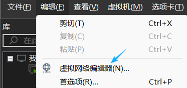
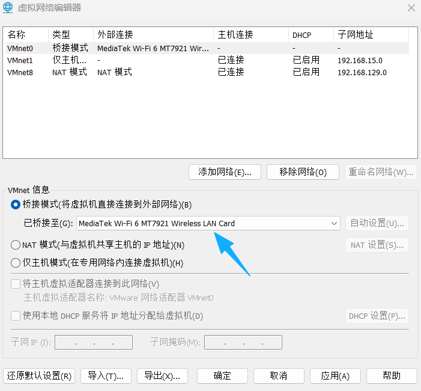
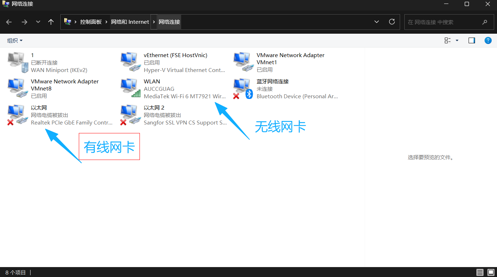
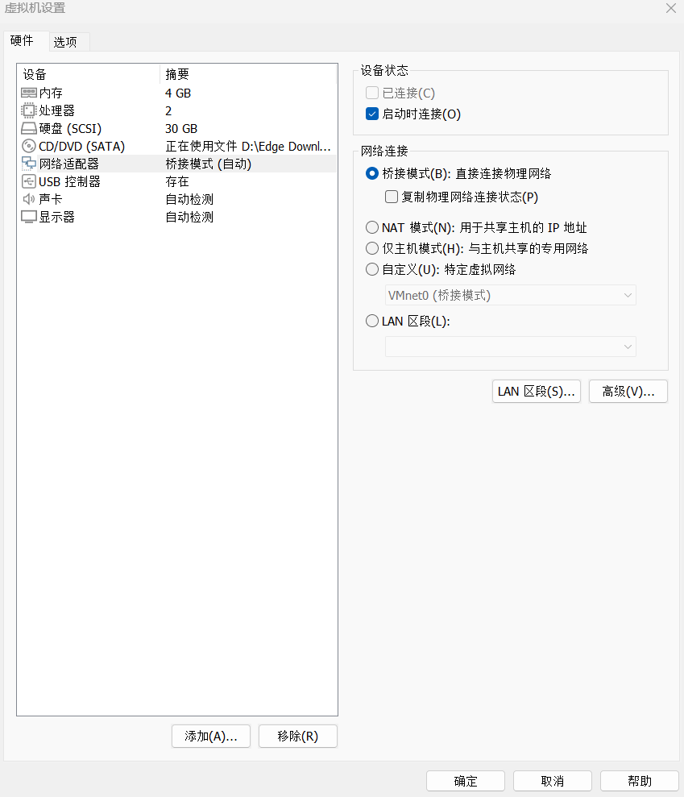
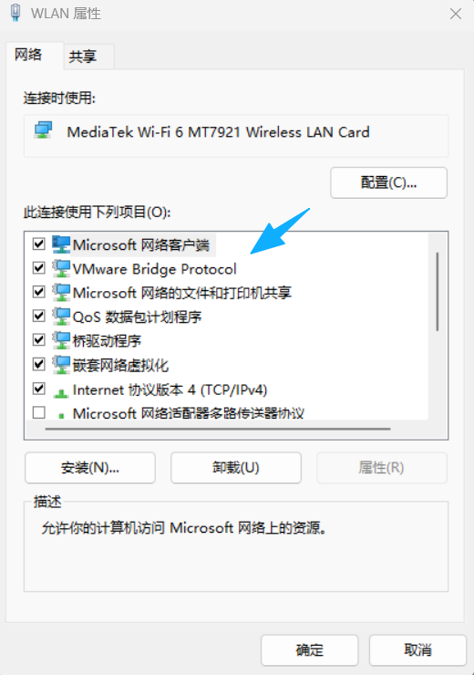
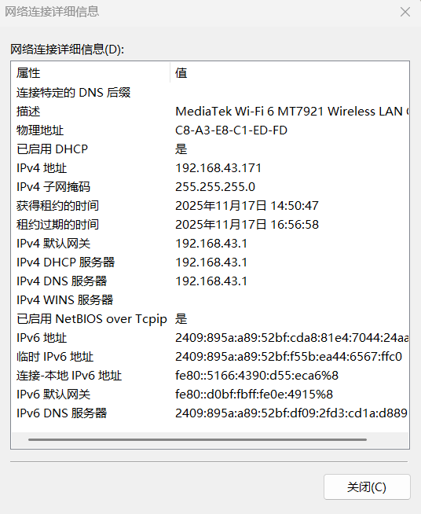
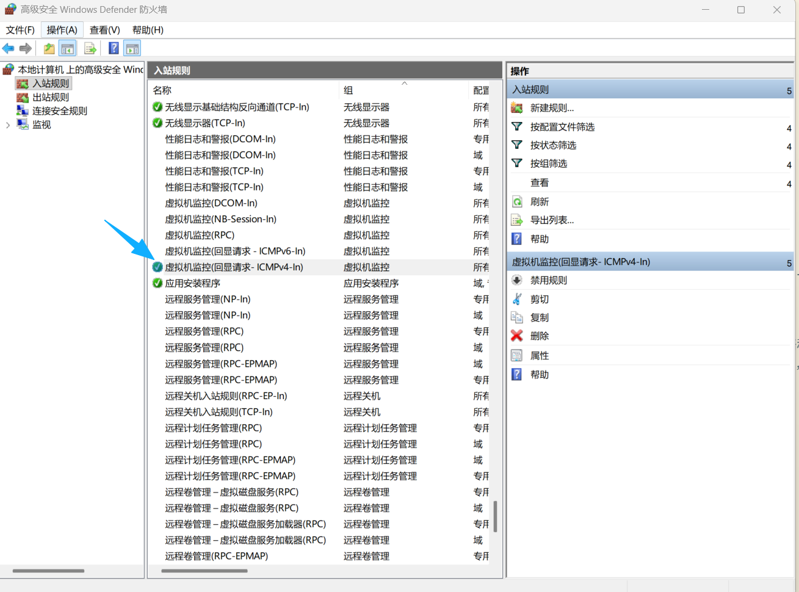
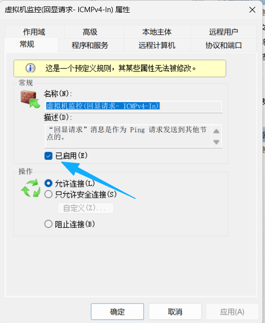

最近在折腾虚拟机配置 VPN 时遇到了桥接模式配置的问题，这里简单总结一下。使用的虚拟机软件为 VMware Workstation 17 Pro(v17.5.0)，虚拟机系统为 Ubuntu Server 24.04.3 LTS。关于如何安装虚拟机，这里不再赘述，网上各处都有图文并茂的教程。

## 1、VMware 配置

### 1.1 编辑虚拟网络配置
首先以管理员身份运行 VMware，找到导航栏：编辑 -> 虚拟网络编辑器。


&nbsp;&nbsp;&nbsp;&nbsp;&nbsp;&nbsp;&nbsp;&nbsp;然后把 VMnet0 的桥接对象选为电脑的网卡
 

电脑网卡型号可以在：控制面板 -> 网络和 Internet -> 查看网络状态和任务 -> 更改适配器设置 处查看


### 1.2 更改虚拟机设置
然后在 VMware 导航栏：虚拟机 -> 设置 处将虚拟机网络模式改为桥接模式，如下图：


## 2、宿主机设置
### 2.1 桥接协议检查 
首先确保你的网络连接状态安装了如下协议，查看方式为：控制面板 -> 网络和 Internet -> 查看网络状态和任务 -> 更改适配器设置 -> 右键目前的网络连接设备 -> 属性。若未安装，请自行查找教程安装。


### 2.2 记录当前网络信息
查看当前网络的 ipv4 地址、ipv4 子网掩码、ipv4 默认网关及 ipv4 DNS 服务器，查看方式为：控制面板 -> 网络和 Internet -> 查看网络状态和任务 -> 更改适配器设置 -> 右键目前的网络连接设备 -> 状态 -> 详细信息，记录下来，待会写配置文件的时候要用


### 2.3 允许接收 ping 数据包
打开：控制面板 -> 系统与安全 -> Windows Defender 防火墙 -> 高级设置 -> 入站规则
找到虚拟机监控（回显请求ICMPv4-In）一项，右键 -> 属性 -> 选择已启用





笔者自己配置的时候，就是因为没有改这个设置，导致虚拟机一直 ping 不通宿主机，非常的头疼。上网查了一下才知道，安装虚拟机软件的时候，Windows防火墙是默认不允许虚拟机 ping 主机的。这里的回显请求（ICMP Echo Request）就是 ping 命令发送的报文，在防火墙允许虚拟机 ping 的报文入站，虚拟机就能 ping 通宿主机了。

## 3、虚拟机系统设置
启动虚拟机，进入系统；Ubuntu 系统的 ipv4 配置文件存放在 /etc/netplan 目录下；

### 3.1 删除默认配置文件
首先删除原来的配置文件
```shell
ls /etc/netplan
# 若有默认文件，删除之
sudo rm /etc/netplan/<default_config_file>
```

### 3.2 新建配置文件
```shell
# 新建文件
sudo vim /etc/netplan/00_custom_config.yaml

# 查看网卡名称
ip a  # 应该会出现两项，lo之外的另一个就是虚拟机的网卡，笔者的为 ens33
```
把下面的内容写入新建的配置文件

```yaml
network:
  version: 2
  ehernets:
    ens33:    # 虚拟机网卡名称
      dhcp4: false
      addresses:
        - 192.168.43.x/24       # 此处设置虚拟机的 ipv4 地址，网段应与宿主机一致；子网掩码若为255.255.255.0，斜杠后填24即可；若为其它，可询问大模型如何填写，此处不再赘述。
      routes:
        - to: default
          via: 192.168.43.1     # 此处填写 ipv4 默认网关地址
      nameservers:
        addresses:
          - 192.168.43.1        # 此处填写 ipv4 DNS 服务器地址
```
保存并退出

应用配置
```shell
sudo netplan apply
ip a    # 检查配置是否生效
```
尝试宿主机与虚拟机互ping，应该是能ping通的
&nbsp;&nbsp;&nbsp;&nbsp;&nbsp;&nbsp;&nbsp;&nbsp;
&nbsp;&nbsp;&nbsp;&nbsp;&nbsp;&nbsp;&nbsp;&nbsp;
&nbsp;&nbsp;&nbsp;&nbsp;&nbsp;&nbsp;&nbsp;&nbsp;
